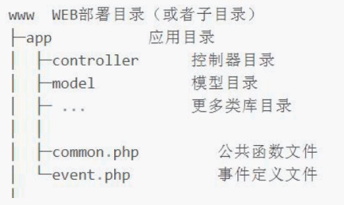
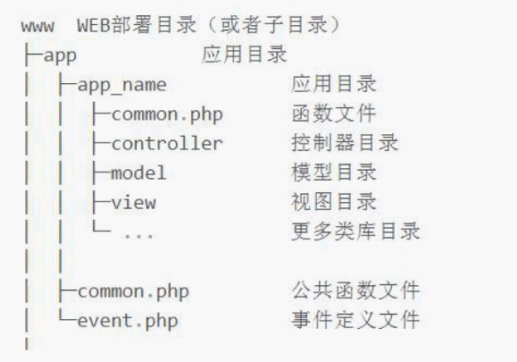
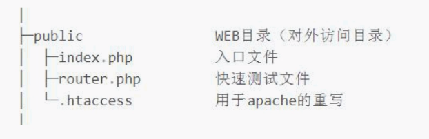
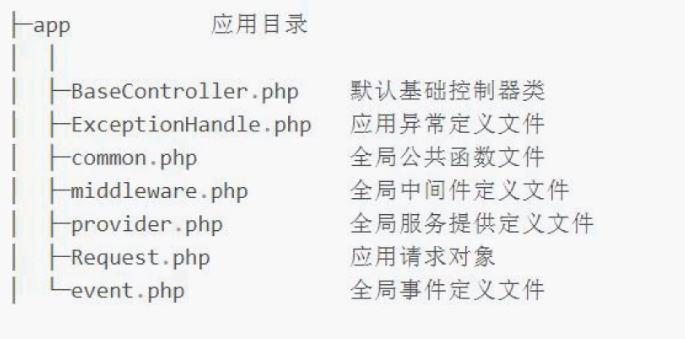

## 一、开发规范

1. tp6遵循的是PSR-2的命名规范和PSR-4的自动加载。
2. 目录和文件的规范如下：
   1. 目录名（小写+下划线）
   2. 类库和函数文件统一以.php为后缀
   3. 类的文件名均以命名空间定义，并且命名空间的路径和类库文件所在路径一致
   4. 类（包含接口和Trait）文件采用驼峰式命名（首字母大写），其他采用小写+下划线命名
   5. 类名（包含接口和Trait）和文件名保持一致，统一采用驼峰式命名（首字母大写）
3. 函数和类、属性命名规范如下：
   1. 类的命名采用驼峰法（首字母大写），如：User、UserType
   2. 函数的命名使用小写字母和下划线（小写字母开头）的方式，如：get_client_ip
   3. 方法的命名使用驼峰法（首字母小写），如：getUserName
   4. 属性的命名使用驼峰法（首字母小写），如：tableName
   5. 特例：以双下划线“ __ ”打头的函数或方法作为魔术方法，如：`__call和`__autoload
4. 常量与配置的规范如下：
   1. 常量以大写字母和下划线命名，如：APP_PATH
   2. 配置参数以小写字母和下划线命名，如：url_convert
   3. 环境变量定义使用大写字母和下划线命名，如：APP_DEBUG
5. 数据表和字段的规范如下：
   1. 数据表和字段采用小写加下划线方式命名
   2. 注意字段名不要以下划线开头，如：think_user表和user_name表
   3. 字段不建议使用驼峰和中文作为数据表及字段命名

## 二、目录结构

1. tp6支持多应用模式部署，app是应用目录

2. 默认情况下，是采用单模式，如下结构：

   3.多应用模式，如下结构：

    

   4. 上图，app_name可以有多个，即多应用模式

   5. 在目录结构上，只确保对外仅可访问public目录

   6.在app目录中，还提供了一些文件

   

## 三、开启调试与配置文件

### 1、开启调试

1. 在开发阶段，建议开启框架调试模式
2. 调试模式开启后，会牺牲一些执行效率，但是大大提高了开发拍错的能力
3. 当项目部署到生产环境时，再关闭调试模式即可
4. 安装好的tp6默认并没有开启调试，可以在域名后面乱输入一些字符，然后回车
5. 此时，页面会提示：“页面错误，请稍后再试~”，表示调试未开启
6. 通过命令行安装tp6，会自动在根目录生成一个.example..env文件
7. .env文件是环境配置文件，我们只要删除签名的.example.即可生效
8. 此时刷新页面，右下角会出现Trace调试小图标，说明调试开启了
9. 查看.env文件，打开调试的环境变量为：APP_DEBUG = true，false关闭
10. 开启调试模式显著优势：
    1. 记录系统运行流程执行过程
    2. 展示错误和调试信息，并开启日志记录
    3. 模板修改可以及时生效，不会被缓存干扰
    4. 启动右下角的Trace调试功能，更加强大
    5. 发生异常时，也会显示异常信息
11. 当然还有一种模式，就是关闭调试的时候，也可以显示简要的错误信息
12. 首先，关闭调试模式：APP_DEBUG = false
13. 然后根目录下config的app.php最后一项设置为：

```
'show_error_msg' => true
```

### 2、配置信息

1. 配置文件有两种形式，开启模式我们采用的.env文件是一种，适合本地
2. 另一种配置文件，在根目录下的config里，有很多类型的配置，适合部署
3. 官方手册明确表示：.env环境变量用于本地开发测试，部署后会被忽略
4. 那么，怎么去获取这些配置文件的值呢？
5. 对于.env文件，比如：[DATABASE]下的HOSTNAME = 127.0.0.1 获取方式如下：

```
use think\facade\Env;
return Env::get('database.hostname');
```

6. 对于config文件，比如：database.php下的hostname，获取方式如下：

```
use think\facade\Config;
return Config::get('database.connections.mysql.hostname');
```

7. 也可以判断这两种配置是否存在，使用has方法判断

```
echo Env::has('database.hostname');
echo Config::has('database.connections.mysql.hostname');
```

8. 关于这两种配置文件的优先级，在本地测试时.env优先于config
9. 从config配置中可以看出，它是先读取.env的，然后在默认配置一个自己的
10. 而到了部署环境，.env会被忽略，则自动切换到config配置

## 四、url访问模式

### url解析

1. tp框架非常多的操作都是通过url来实现的
2. 多应用：http://servername/index.php /应用/控制器/操作/参数/值……
3. 单应用：http://servername/index.php /控制器/操作/参数/值……
4. 由于tp6默认是单应用模式，多应用需要作为扩展安装
5. http://servername 是域名地址，如：127.0.0.1:8000
6. index.php是根目录下public下的index.php入口文件
7. 控制器：app目录下有一个controller控制器目录Index.php控制器
8. Index.php控制器的类名也必须是class Index
9. 操作就是控制器类里面的方法，比如：index或者hello
10. 完整形式：http://ldz.tp6.com/test/hello/value/world

```
<?php
namespace app\controller;

class Test
{
    public function hello($value = ''){
        return 'hello '.$value;
    }
}
```

11. public/index.php中的index.php可以省略，只要设置URL重写即可
12. httpd.conf配置文件中加载了mod_rewrite.so模块
13. AllowOverride None将None改为All

**注：某些情况下根目录public文件夹下的.htaccess不起作用，需要做如下修改：**

```
倒数第二行修改：

RewriteRule ^(.*)$ index.php/$1 [QSA,PT,L]
修改为
RewriteRule ^(.*)$ index.php?/$1 [QSA,PT,L]
```

## 五、基础、空、多级控制器

### 1、基础控制器

1. 一般来说，创建控制器后，推荐继承基础控制器来获得更多的方法
2. 基础控制器仅仅提供了控制器验证功能，并注入think\App和think\Request
3. 这两个对象后面会详细讲解，下面继承并简单实用一下：

```
<?php
namespace app\controller;
use app\BaseController;

class Test extends BaseController
{
    public function index(){
        //返回实际路径
        echo '当前方法名为：'.$this->request->action().'<br />';
        echo '当前实际路径：'.$this->app->getBasePath();
    }
}
```

### 2、空控制器

在单应用模式下，我们可以给项目定义一个Error控制器类，来提示错误：

```
<?php
namespace app\controller;

class Error
{
    public function index(){
        return '控制器不存在';
    }
}
```

### 3、多级控制器

1. 所谓多级控制器，就是在控制器controller目录下再建立目录并创建控制器
2. 我们在controller目录下建立group目录，并创建Blog.php控制器
3. 此时，访问地址为：http://ldz.tp6.com/group.blog/read

```
<?php
namespace app\controller\group;

class Blog
{
    public function index(){
        return 'this is group/blog';
    }

    public function read(){
        return 'read……';
    }
}
```

## 六、连接数据库与模型初探

### 1、连接数据库

1. tp采用内置抽象层将不同数据库操作进行封装处理
2. 数据抽象层基于PDO模式，无须针对不同数据库编写相应代码
3. 使用数据库的第一步，就是连接数据库
4. 在根目录的config下的database.php可以设置数据库的链接信息
5. 大部分系统已经给了默认值，只需要修改和填写需要的值即可
6. 本地测试，会优先采用.env的配置信息，与database配置对应上即可

```
// 数据库类型
'type'              => env('database.type', 'mysql'),
// 服务器地址
'hostname'          => env('database.hostname', '127.0.0.1'),
// 数据库名
'database'          => env('database.database', ''),
// 用户名
'username'          => env('database.username', 'root'),
// 密码
'password'          => env('database.password', ''),
// 端口
'hostport'          => env('database.hostport', '3306'),
// 数据库连接参数
'params'            => [],
// 数据库编码默认采用utf8
'charset'           => env('database.charset', 'utf8'),
// 数据库表前缀
'prefix'            => env('database.prefix', ''),
```

7. 可以通过删除改变.env的配置，或删除.env来验证database的执行优先级

8. 在database.php配置中，default表示设置默认的数据库连接

9. connections配置数据库连接信息，可以使多个数据库，便于切换

10. 默认数据库连接名称为：'mysql'，再复制一组数据库连接信息：'demo'切换

11. 创建一个用于测试数据库连接的控制器：DataTest.php

    - 根目录下的.env文件：

    ```
    APP_DEBUG = true
    
    [APP]
    DEFAULT_TIMEZONE = Asia/Shanghai
    
    [DATABASE]
    TYPE = mysql
    HOSTNAME = 127.0.0.1
    DATABASE = tp6-1
    DATABASE2 = tp6-2
    USERNAME = root
    PASSWORD = root
    HOSTPORT = 3306
    CHARSET = utf8
    DEBUG = true
    
    [LANG]
    default_lang = zh-cn
    ```

    - config/database.php

    ```
    <?php
    
    return [
        // 默认使用的数据库连接配置
        'default'         => env('database.driver', 'mysql'),
    
        // 自定义时间查询规则
        'time_query_rule' => [],
    
        // 自动写入时间戳字段
        // true为自动识别类型 false关闭
        // 字符串则明确指定时间字段类型 支持 int timestamp datetime date
        'auto_timestamp'  => true,
    
        // 时间字段取出后的默认时间格式
        'datetime_format' => 'Y-m-d H:i:s',
    
        // 数据库连接配置信息
        'connections'     => [
            'mysql' => [
                // 数据库类型
                'type'              => env('database.type', 'mysql'),
                // 服务器地址
                'hostname'          => env('database.hostname', '127.0.0.1'),
                // 数据库名
                'database'          => env('database.database', ''),
                // 用户名
                'username'          => env('database.username', 'root'),
                // 密码
                'password'          => env('database.password', ''),
                // 端口
                'hostport'          => env('database.hostport', '3306'),
                // 数据库连接参数
                'params'            => [],
                // 数据库编码默认采用utf8
                'charset'           => env('database.charset', 'utf8'),
                // 数据库表前缀
                'prefix'            => env('database.prefix', ''),
    
                // 数据库部署方式:0 集中式(单一服务器),1 分布式(主从服务器)
                'deploy'            => 0,
                // 数据库读写是否分离 主从式有效
                'rw_separate'       => false,
                // 读写分离后 主服务器数量
                'master_num'        => 1,
                // 指定从服务器序号
                'slave_no'          => '',
                // 是否严格检查字段是否存在
                'fields_strict'     => true,
                // 是否需要断线重连
                'break_reconnect'   => false,
                // 监听SQL
                'trigger_sql'       => env('app_debug', true),
                // 开启字段缓存
                'fields_cache'      => false,
                // 字段缓存路径
                'schema_cache_path' => app()->getRuntimePath() . 'schema' . DIRECTORY_SEPARATOR,
            ],
            'demo' => [
                // 数据库类型
                'type'              => env('database.type', 'mysql'),
                // 服务器地址
                'hostname'          => env('database.hostname', '127.0.0.1'),
                // 数据库名
                'database'          => env('database.database2', 'tp6-2'),
                // 用户名
                'username'          => env('database.username', 'root'),
                // 密码
                'password'          => env('database.password', 'root'),
                // 端口
                'hostport'          => env('database.hostport', '3306'),
                // 数据库连接参数
                'params'            => [],
                // 数据库编码默认采用utf8
                'charset'           => env('database.charset', 'utf8'),
                // 数据库表前缀
                'prefix'            => env('database.prefix', ''),
    
                // 数据库部署方式:0 集中式(单一服务器),1 分布式(主从服务器)
                'deploy'            => 0,
                // 数据库读写是否分离 主从式有效
                'rw_separate'       => false,
                // 读写分离后 主服务器数量
                'master_num'        => 1,
                // 指定从服务器序号
                'slave_no'          => '',
                // 是否严格检查字段是否存在
                'fields_strict'     => true,
                // 是否需要断线重连
                'break_reconnect'   => false,
                // 监听SQL
                'trigger_sql'       => env('app_debug', true),
                // 开启字段缓存
                'fields_cache'      => false,
                // 字段缓存路径
                'schema_cache_path' => app()->getRuntimePath() . 'schema' . DIRECTORY_SEPARATOR,
            ],
            // 更多的数据库配置信息
        ],
    ];
    
    ```

    - DataTest.php控制器

    ```
    <?php
    namespace app\controller;
    
    use think\facade\Db;
    
    class DataTest
    {
        public function index(){
            $data = Db::connect('mysql')->table('table1')->select();
            return json($data);
        }
    
        public function demo(){
            $data = Db::connect('demo')->table('table1')->select();
            return json($data);
        }
    }
    ```


### 2、模型初探

1. 在app目录下创建一个model目录，并创建Table1.php模型类

```
<?php
namespace app\model;
use think\Model;

class Table1 extends Model
{
    
}
```

2. Table1继承模型基类，即可实现数据库调用
3. 受保护字段$connection，则可以切换到demo数据库

```
<?php
namespace app\model;
use think\Model;

class Table1 extends Model
{
    protected $connection = 'mysql';
}
```

4. 控制器调用方式如下：

```
<?php
namespace app\controller;

use app\model\Table1;
use think\facade\Db;

class DataTest
{
    public function index(){
        $data = Db::connect('mysql')->table('table1')->select();
        return json($data);
    }

    public function demo(){
        $data = Db::connect('demo')->table('table1')->select();
        return json($data);
    }

    public function Table1(){
        $data = Table1::select();
        return json($data);
    }
}
```

## 七、数据库的数据查询

### 1、单数据查询

1. Db::table()中的table必须制定完整数据表，包括前缀
2. 如果希望只查询一条数据，可以使用find()方法，需制定where条件，未查询到值，则返回null

```
$data = Db::table('table1')->where('id', 30)->find();
```

3. Db::getLastSql()方法，可以得到最近一条SQL查询的原生语句

```
SELECT * FROM `table1` WHERE `id` = 30 LIMIT 1
```

4. 使用findOrFail()方法，查询一条数据，在没有数据时抛出一个异常

```
$data = Db::table('table1')->where('id', 30)->findOrFail();
```

5. 使用findOrEmpty()方法，查询一条数据，在没有数据时返回一个空数组

```
$data = Db::table('table1')->where('id', 30)->findOrEmpty();
```

### 2、数据集查询

1. 获取多列数据，可以使用select()方法，未查询到数据，返回空数组

```
$data = Db::table('table1')->select();
SELECT * FROM `table1`
```

2. 使用selectOrFail()方法，查询多列数据，未查询到数据，抛出异常

```
$data1 = Db::table('talbe1')->where('id', 30)->selectOrFail();
```

3. 在select()方法后加入toArray()方法，可以将数据集对象转化为数组

```
$data3 = Db::table('table1')->select()->toArray();
dump($data3);
```

4. 当在数据库配置文件中设置了前缀，我们可以使用name()方法忽略前缀

```
Db::name('table1')->select()
```

### 3、其他查询

1. 通过value()方法，可以查询指定字段的值（单个），没有数据返回null

```
$data = Db::table('table1')->where('id', 3)->value('name');
echo $data;
```

2. 通过colum()方法，可以查询指定字段的值（多个），没有数据返回空数组

```
$data1 = Db::table('table1')->column('name, school');
return json($data1);
```

3. 可以指定id作为列值的索引

```
$data1 = Db::table('table1')->column('name', 'id');
return json($data1);
```

4. 如果处理的数据巨大，成百上千，一次性读取有可能会导致内存开销过大，为了避免内存处理太多数据错处，可以使用chunk()方法分批处理数据
5. 如：每次只处理100条，处理完毕后，再读取100条继续处理

```
Db::table('table1')->chunk(3, function ($datas){
    foreach ($datas as $data){
    	dump($data);
    }
    echo '------------------------------------------------';
});
```

6. 可以利用游标查询功能，可以大幅度减少海量数据内存开销，利用php生成器特性。每次查询只读取一行，然后再读取时，自动定位到下一行继续读取

```
$cursor = Db::table('table1')->cursor();
foreach ($cursor as $item) {
	dump($item);
}
```

## 八、数据库链式查询

### 1、查询规则

1. 我们通过指向符号“->”多次连续调用方法称为：链式查询
2. 当Db::name('user')时，返回查询对象(Query)，即可连戳数据库对应的方法
3. 每次执行一个数据库查询方法时，如：where()，还将返回查询对象(Query)
4. 只要还是数据库对象，那么久可以一直使用指向符号进行链式查询
5. 再利用find()、select()等方法返回数组(Array)或数据集对象(Colletion)
6. 而find()和select()是结果查询方法，并不是链式查询方法

```
Db::name('user')->where('id', 3)->order('id', 'desc')->find()
```

7. 除了查询方法可以使用链式连贯操作，CURD操作也可以使用

### 2、更多查询

1. 如果多次使用数据库查询，那么每次静态创建都会生成一个实例，造成浪费
2. 我们可以把对象实例保存下来，再进行反复调用即可

```
$table1 = Db::table('table1');
$data1 = $table1->where('id', 3)->find();
$data2 = $table1->select();
```

3. 当同一对象实例第二次查询后，会保留第一次查询值

```
$table1 = Db::table('table1');
$data1 = $table1->where('id', 3)->find();
$data2 = $table1->select();

SELECT * FROM `table1` WHERE `id` = 3
```

4. 使用removeOption()方法，可以清理上一次查询保留的值

```
$table1 = Db::table('table1');
$data1 = $table1->where('id', 3)->find();
// $data2 = $table1->select();
$table1->removeOption('where')->select();
return Db::getLastSql();

SELECT * FROM `table1`
```

## 九、数据库的数据新增

### 1、单数据新增

1. 使用insert()方法可以向数据表添加一条数据，新增成功，返回1

```
$data = [
    'name'=>'哈哈',
    'school'=>'哈班',
    'sex'=>'女'
];
Db::table('table1')->insert($data);
```

2. 如果添加一个不存在的字段数据，会抛出异常Exception
3. 如果想强行新增抛弃不存在的字段数据，则使用strick(false)方法，忽略异常

```
$data = [
    'name'=>'哈哈11',
    'school'=>'哈班11',
    'sex'=>'女1',
    'status'=>0 //数据库不存在该字段
];
Db::table('table1')->strict(false)->insert($data);
```

4. 如果我们采用数据库是mysql，可以支持replace写入
5. insert和replace写入的区别，前者表示表中存在主键相同则报错，后者则修改

```
$data = [
    'name'=>'哈哈11',
    'school'=>'哈班11',
    'sex'=>'女1',
    'status'=>0 //数据库不存在该字段
];
Db::table('table1')->replace()->insert($data);
```

6. 使用insertGetId()方法，可以在新增采成功后返回当前数据ID

```
$data = [
    'name'=>'哈哈11',
    'school'=>'哈班11',
    'sex'=>'女1'
];
return Db::table('table1')->insertGetId($data);
```

### 2、批量新增数据

1. 使用insertAll()方法，可以批量新增数据，但要保持数据结构一致

```
$data = [
    [
        'name'=>'嘿嘿1',
        'school'=>'嘿班1'
    ],
    [
        'name'=>'嘿嘿2',
        'school'=>'嘿班2'
    ]
];
return Db::name('table1')->insertAll($data);
```

2. 批量新增也支持replace()方法，添加后改变成replace into

```
Db::name('table1')->save($data);
```

### 3、save新增

1. save()方法时一个通用方法，可以自行判断是新增还是修改数据
2. save()方法判断是否为新增或修改的依据为：是否存在主键，不存在则为新增

```
$data = [
    'name'=>'哈哈11',
    'school'=>'哈班11',
    'sex'=>'女1',
];
return Db::name('table1')->save($data);
```

## 十、数据库的修改删除

### 1、数据修改

1. 使用update()方法修改数据，修改成功返回影响行数，未成功修改返回0

```
$data = [
	'name'=>'哈嘿1'
];
return Db::name('table1')->where('id', 7)->update($data);
```

2. 如果修改数据包含了主键信息，如：id，则可以省略where条件

```
return Db::name('table1')->update([
    'id'=>7,
    'name'=>'哈哈11'
]);
```

3. 如果想让一些字段修改时执行SQL函数操作，可以使用exp()方法实现

```
Db::name('table1')->where('id', 17)
            ->exp('sex','UPPER(sex)') //让sex值全部大写
            ->update();
```

4. 如果要自增/自减某个字段，可以使用inc/dec方法，并支持自定义步长

```
Db::name('table1')->where('id', 18)
            ->inc('age') 		//自增1
            ->dec('weight', 2)	//自减2
            ->update();
```

5. 使用::raw()方法实现上面第三、四条的修改

```
Db::name('table1')->where('id', 17)
            ->update([
                    'sex'=>     Db::raw('UPPER(sex)'),
                    'age'=>     Db::raw('age+1'),
                    'weight'=>  Db::raw('weight-2')
                ]);
```

6. 使用save()方法进行修改数据，必须指定主键才能实现修改

```
Db::name('table1')->where('id', 17)->save(['name'=>'不知道']);
```

### 2、数据删除

1. 根据主键直接删除，删除成功返回影响行数，否则为0

```
Db::name('table1')->delete(19);
```

2. 根据主键，还可以删除多条记录

```
Db::name('table1')->delete([10, 11, 12]);
```

3. 正常情况下，通过where()方法来删除

```
Db::name('table1')->where('id', 13)->delete();
```

4. 通过true参数删除数据表所有数据

```

```

